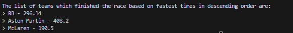

Sorting Fastest Team Data
• Sort the teams according to which was fastest and display to the user in descending order. 

Although I still found a way to implement the sort fastest teams function of the analysis. It wasn't based off something I learnt in the course.
I searched up online how to sort out arrays and found a way to do it using compartator and stream classes.

Below is my code in which i tried using bubble sort to sort out fast team, and attached is an image of the output i got.

Image of my output:

Code I used which implemented the bubble sort method to sort teams:

    public void sortingTeams(Team[] teamsArray, int teamNumber) {
        Team temp;

        // Calculate the combined fastest times for each team
        for (int i = 0; i < teamNumber; i++) {
            for (int j = i + 1; j < teamNumber; j++) {
                if (teamsArray[i].getName().equals(teamsArray[j].getName())) {
                    double combinedFastestTime = teamsArray[i].getFastestLap() + teamsArray[j].getFastestLap();
                    teamsArray[i].addFastestTime(combinedFastestTime);
                    teamsArray[j].addFastestTime(combinedFastestTime);
                }
            }
        }
        
        // Calculate the combined fastest times for each team
        for (int i = 0; i < teamNumber; i++) {
            for (int j = i + 1; j < teamNumber; j++) {
                if (teamsArray[i] != null && teamsArray[j] != null && teamsArray[i].getName().equals(teamsArray[j].getName())) {
                    // Only add j's time to i, and then nullify j to avoid further comparisons.
                    teamsArray[i].addFastestTime(teamsArray[j].getFastestLap());
                    teamsArray[j] = null;
                }
            }
        }

        // Bubble sort the teams based on fastest lap times
        for (int i = 0; i < teamNumber - 1; i++) {
            for (int j = 0; j < teamNumber - 1 - i; j++) {
                if (teamsArray[j] != null && teamsArray[j + 1] != null && teamsArray[j].getFastestLap() > teamsArray[j + 1].getFastestLap()) {
                    temp = teamsArray[j];
                    teamsArray[j] = teamsArray[j + 1];
                    teamsArray[j + 1] = temp;
                }
            }
        }

        printSortedTeams( teamsArray);
    }

    /**
     * This method will print the sorted list of teams
     */
    private void printSortedTeams( Team[] teamsArray){
        System.out.println();
        System.out.println("The list of teams which finished the race based on fastest times in descending order are:");
        for (int i = 0; i < teamsArray.length; i++) {
            if (teamsArray[i] != null) {
                System.out.println("> " + teamsArray[i].getName() + " - " + teamsArray[i].getFastestLap());
            }
        }
    }